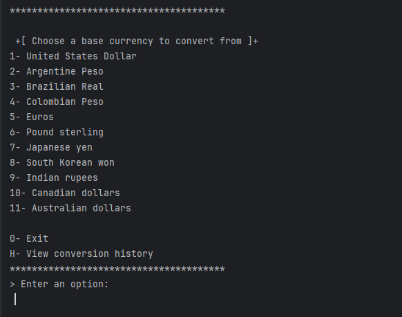
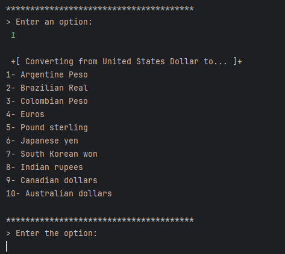
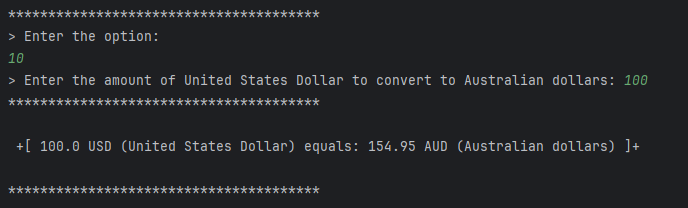
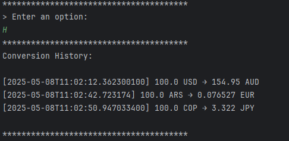

<!-- Improved compatibility of back to top link -->
<a id="readme-top"></a>

<!-- PROJECT LOGO -->
<br />
<div align="center">
  <a href="https://github.com/AgustinV16/Money-Exchange">
    
  </a>

<h3 align="center">Currency Converter</h3>

  <p align="center">
    Java Console Project | Alura G8 Challenge
    <br />
    <br />
    <br />
    <a href="https://github.com/AgustinV16/Money-Exchange">View Repository</a>
  </p>
</div>

---

## 📑 Table of Contents

- [About The Project](#about-the-project)
- [Built With](#built-with)
- [Getting Started](#getting-started)
    - [Prerequisites](#prerequisites)
    - [Installation](#installation)
    - [Functionalities](#functionalities)
    - [Feature Demonstration](#-feature-demonstration)
- [Acknowledgments](#acknowledgments)

---

## 🧾 About The Project

This Java console application was developed as part of the **"Practicando con java: Challenge Conversor de Monedas"** in the Alura LATAM " Java Orientado a Objetos G8 - ONE" course.

It allows the user to convert an amount from one currency to another using real-time exchange rates from an online API. The application also logs the conversion history, including timestamps and currencies involved.

<p align="right">(<a href="#readme-top">back to top</a>)</p>

---

## 🛠️ Built With

* 
* 
* 

<p align="right">(<a href="#readme-top">back to top</a>)</p>

---

## 🚀 Getting Started

To run this project locally, follow the instructions below.

### ✅ Prerequisites

You will need:
- Java 17 or later installed
- A GitHub account (if you want to clone it)
- An internet connection (to access the exchange rate API)
- A valid [ExchangeRate-API](https://www.exchangerate-api.com/) key
- (Optional) IntelliJ IDEA or another IDE to run the program

### 🛠 Installation

1. Clone the repo
   ```sh
   git clone https://github.com/AgustinV16/Money-Exchange.git

2. Add a `.env` file in the root directory with your API key:
   ```env
   API_KEY=your_exchange_rate_api_key_here
   ```

3. Build and run the `Main.java` file from your IDE or terminal.

4. The program will launch in the console. Follow the instructions displayed.

<p align="right">(<a href="#readme-top">back to top</a>)</p>

---

## ⚙️ Functionalities

#### ✅ Currency Conversion
- Select a base and a target currency from a dynamic list.
- Enter the amount to convert.
- View real-time results using ExchangeRate-API.

#### 📚 Conversion History
- Every conversion is logged with timestamp, currency pair, and result.

#### 🕒 Time-Stamped Logs
- Using `java.time`, each entry includes the exact moment it was made.

#### 🌍 Multi-Currency Support
- Supports USD, ARS, BRL, COP, EUR, GBP, JPY, KRW, INR, CAD, AUD, and more.

<p align="right">(<a href="#readme-top">back to top</a>)</p>

---

## 🖼️ Feature Demonstration

### 💱 Currency Conversion Example






### 🕒 Conversion History with Timestamp


### ✅ Program Exit (Code 0)


---

## 🙌 Acknowledgments

* [Alura LATAM](https://app.aluracursos.com)
* [ExchangeRate-API](https://www.exchangerate-api.com/)
* [Stack Overflow](https://stackoverflow.com)
* [Gson by Google](https://github.com/google/gson)
* [Java HttpClient](https://docs.oracle.com/en/java/javase/11/docs/api/java.net.http/java/net/http/HttpClient.html)

<p align="right">(<a href="#readme-top">back to top</a>)</p>
